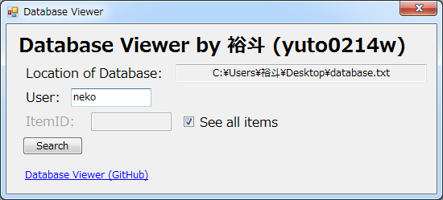

# Database Viewer
</br>A database viewer for Windows. (English description available on below Japanese description)</br></br>As-is: It can read database</br>To-be: Can read and write
## 説明
特定の形式で書いた `.txt` をデータベースとして読み込めます。
### 書き方
```ユーザー名;メッセージ;ID;```
### 使い方
#### 1. ユーザー名で指定する
  1. 起動したら `Click here!` をクリック
  2. 作ったデータベースのファイルをクリック
  3. `See all items` にチェックを入れる
  4. `User` の横のテキストボックスにデータベースに書いたユーザー名を入力
  5. `Search` をクリック
#### 2. IDで指定する
  1. 同じ (2. 同じ)
  3. `ItemID` の横にあるテキストボックスにデータベースに書いたIDを入力
  4. `Search` をクリック
## Description
Writing the `.txt` in a certain form will change the text to database!
### How to write
```Username;Message;ID;```
### How to use
#### 1. Specify using Username
  1. First, when started, click `Click here!`
  2. Select database.
  3. Check to `Show all items`
  4. Type Username to `User`
  5. and click `Search`
#### 2. Specify using ID
  1. same (2. same)
  3. Type ID to `ItemID`
  4. Click `Search`
